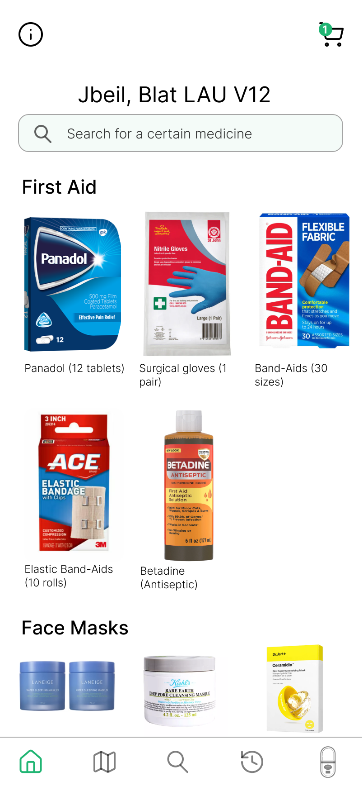
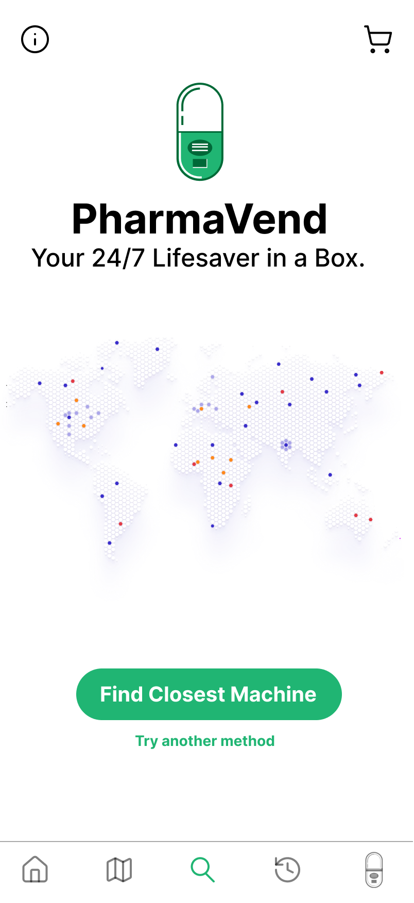
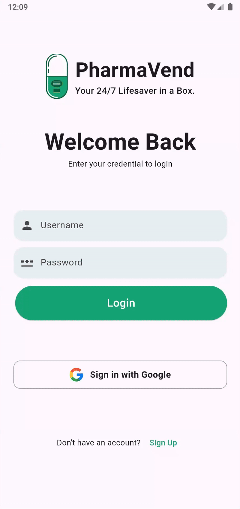
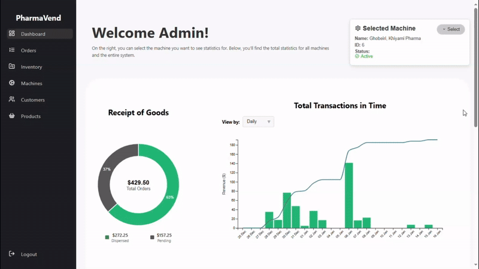
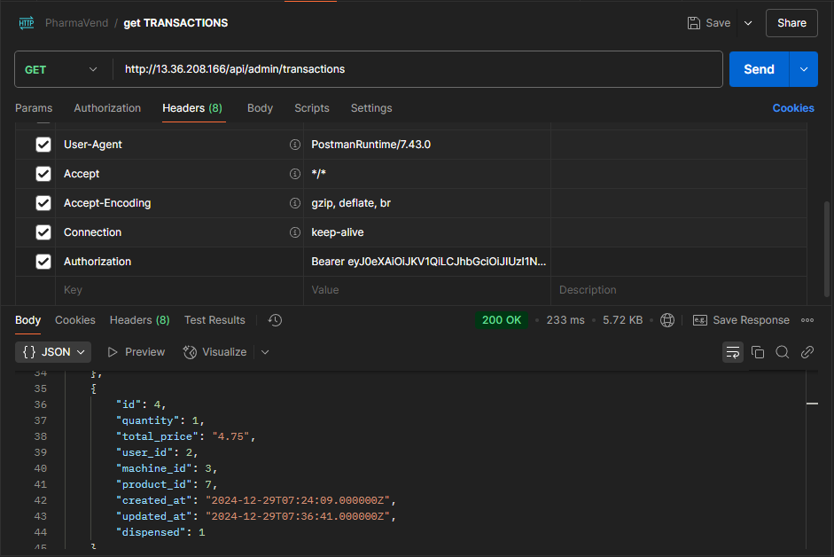
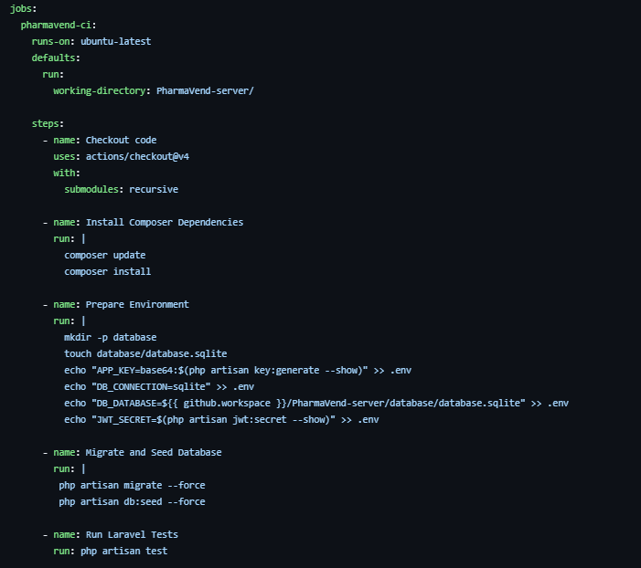

<br><br>

<!-- project philosophy -->


> A smart pharmaceutical vending machine that aims to address the unavailability of basic pharmaceuticals and ensure their accessibility in situations where pharmacies are closed or unavailable. By integrating microcontrollers, actuators, and advanced technologies, we automate the dispensing and payment processes to provide convenience and reliability.
>
>Our application offers users interactive real-time tracking map that allows them to locate and navigate to vending machines with complete route guidance and live updates. This project includes an interactive robotic system that simulates customer-device communication with our vending machines. And our customers are always updated through push notifications about new stock additions to nearby vending machines.

### User Stories

#### Customer
- As a Customer, I want to locate nearby vending machines, so I can quickly access essential pharmaceuticals when pharmacies are closed.
- As a Customer, I want to browse available medicines and their details, so I can find and select the medication I need.
- As a Customer, I want the system to guide me to the machine and allow me to shop and dispense medicantions of my choice.

#### Admin 
- As an admin, I want to manage and monitor the stock levels in vending machines, so I can restock them promptly to avoid shortages.
- As an admin, I want to review and analyze sales data, so I can identify trends and improve vending machine performance.
- As an admin, I want the vending machine inventory to be updated in real time and reflected accurately to users, ensuring credibility and trust in the system.
<br><br>
<!-- Tech stack -->


> PharmaVend thrived using the below stacks

###  PharmaVend is -built using the following technologies:

- This project uses the [Flutter app development framework](https://flutter.dev/). Flutter is a cross-platform hybrid app development platform which allows us to use a single codebase for apps on mobile, desktop, and the web.
- For backend development, the app uses [Laravel](https://laravel.com/), a PHP-based framework known for its scalability and robust API handling capabilities.
- The user and admin panel websites are built using [React](https://react.dev/), a front-end library that delivers a dynamic and interactive interface.
- Both the Flutter application and the user admin panel employ [Redux](https://redux.js.org/) for state management. This predictable state container facilitates the handling of state across all user interfaces, enhancing manageability and cleanliness in dynamic and complex applications.

- The application enhances its functionality with several [Google APIs](https://console.cloud.google.com/apis/dashboard?inv=1&invt=AbnWKg), each serving a unique purpose:
  -  [Maps JavaScript API](https://developers.google.com/maps/documentation/javascript/overview): Provides interactive maps and location features on the application and admin panels.
  - [Geolocation API](https://developers.google.com/maps/documentation/geolocation/overview): Allows the app to retrieve the current location of the user by accepting an HTTPS request with the cell tower and WiFi access points that a mobile client can detect. 
  -  [Distance Matrix API](https://developers.google.com/maps/documentation/distance-matrix/overview).: Calculates travel distance and time for a matrix of origins and destinations, useful for managing delivery times and logistics.
  - [Directions API](https://developers.google.com/maps/documentation/directions/overview): Supplies route directions between multiple locations which are used to plot navigational routes on the map. 
  - [Reverse Geocoding API](https://developers.google.com/maps/documentation/geocoding/overview): Converts geographic coordinates into a human-readable address. 
- The project leverages [Firebase](https://console.firebase.google.com/), a comprehensive app development platform by Google, known for its wide array of tools and services:
  - [Google Sign in](https://firebase.google.com/docs/auth/android/google-signin): Integrated for secure and quick user authentication using Google accounts.
  - [Firebase Cloud Messaging](https://firebase.google.com/docs/cloud-messaging): Used for dispatching notifications to enhance user interaction and app communication.
- For secure and efficient payment processing, the application integrates [Stripe](https://stripe.com), a powerful online payment platform, enabling financial transactions within the app.

- The IoT integration is powered by the [Arduino Platform](https://www.arduino.cc/), utilizing the [ESP32 microcontroller](https://www.espressif.com/en/products/socs/esp32) to control actuators for precise and reliable dispensing of products.


<br><br>
<!-- UI UX -->


> We designed PharmaVend using wireframes and mockups, iterating on the design until we reached the ideal layout for easy navigation and a seamless user experience.

- Project [Figma](https://www.figma.com/design/7ouYeUwMOHD4Q3yAhSmUx7/Final-project?node-id=0-1&p=f&t=3UV9S1T6sdou9NPQ-0) design.

### Mockups

| Home Screen                | Map Screen               | Checkout Screen              |
|-------------------------------|--------------------------|--------------------------|
|  |  |  |
<!-- 
| Details Screen                | Cart Screen             | Checkout Screen           |
|-------------------------------|--------------------------|--------------------------|
|  |  |  |

| History Screen                | Dispense Screen          | Landing #2               |
|-------------------------------|--------------------------|--------------------------|
|  |  |  | -->

<br><br>

<!-- Database Design -->


> Below you can see PharmaVend's DB design:


<p align="center">
  
</p>

<br><br>


<!-- Implementation -->


> Below you can see PharmaVend in action:


### User Screens (Mobile)
#### Visual Overview
| Login Screen                | Register Screen               | Landing Screen              |
|-------------------------------|--------------------------|--------------------------|
|  |  |  |

| Notification Screen                | Home Screen             | Map Screen           |
|-------------------------------|--------------------------|--------------------------|
|  |  |  |

| Product Detail Screen                | Cart Display Screen          | Checkout Screen               |
|-------------------------------|--------------------------|--------------------------|
|  |  |  |

| User History Screen                | Product Dispense Screen          |
|-------------------------------|--------------------------|
|  |  | | 

#### Interactive Walkthrough
| Sign Up Demo                | Google Signin Demo               | Find Closest Machine               | 
|-------------------------------|--------------------------|--------------------------|
|  |  |  | 

| Order Demo                | Search medicine Demo               | Notification Update               | 
|-------------------------------|--------------------------|--------------------------|
|  |  |  | 

| Closest Map Navigation              | Machine Map Navigation       |  Pay Online Demo      |
|-------------------------------|-------------------------------|-------------------------------|
|  |  |  |

<br>

### Admin Screens (Web)
#### Visual Overview
| Dashboard Screen #1  | Dashboard Screen #2 |
| ---| ---|
|  |  |

| Orders Screen #1  | Orders Screen #2 |
| ---| ---|
|  |  |

| Inventory Screen #1  | Inventory Screen #2 |
| ---| ---|
|  |  |

| Machines Screen  | Products Screen  |
| ---| ---|
|  |  |

| Customers Screen #1  | Customers Screen #2 |
| ---| ---|
|  |  |

#### Interactive Walkthrough

Dashboard Dashboard



Machine Navigation 


Machine Create


Machine Handeling


Charts Navigation


### Customer Screen (Web)


<br><br>


<!-- Prompt Engineering


###  Mastering AI Interaction: Unveiling the Power of Prompt Engineering:

- This project uses advanced prompt engineering techniques to optimize the interaction with natural language processing models. By skillfully crafting input instructions, we tailor the behavior of the models to achieve precise and efficient language understanding and generation for various tasks and preferences.

<br><br> -->


###  Unleashing the Potential with AWS Integration:

- This project utilizes AWS deployment strategies, specifically using an EC2 instance to host and manage the [Laravel server](https://github.com/jeanpierrenashef/PharmaVend-server), focusing on scalability, reliability, and performance. Additionally, testing was conducted using 
Postman to ensure the server's functionality and responsiveness across various use cases. 

| Login  | Add Machine |
| ---| ---|
|  |  |

| Get Product  | Get Transaction |
| ---| ---|
|  |  |

#### AWS EC2 Server Deployment (Laravel)

1. Install [PuTTY](https://www.putty.org/)
2. If necessary transform .pem to .ppk file using [PuTTYgen](https://www.puttygen.com/)
3. Open PuTTY and connect to the server using SSH
4. Install essential packages and dependencies
   ```sh
   sudo apt update && sudo apt upgrade -y
   sudo apt install -y php-cli php-mbstring php-xml php-bcmath php-curl php-zip \ apache2 mysql-server unzip curl git composer
   ```
5. Set Up Apache and MySQL
   ```sh
   sudo a2enmod rewrite 
   sudo systemctl restart apache2
   ```
6. Clone the Laravel Project
   ```sh
   cd /var/www/html/
   sudo git clone https://github.com/jeanpierrenashef/PharmaVend-server/
   cd PharmaVend-server
   ```
7. Install and Configure Composer
   ```sh
   curl -sS https://getcomposer.org/installer | sudo php -- --install-dir=/usr/local/bin --filename=composer
   sudo composer update
   sudo composer install   
   ```
8. Configure Environment File
   ```sh
   sudo cp .env.example .env
   sudo nano .env
   sudo php artisan key:generate
   ```
9. Apache Configurations:
   - Navigate to:
      ```sh
      sudo nano /etc/apache2/sites-enabled/000-default.conf
      ```
   - Add the following:
      ```sh
      <Directory /var/www/html/PharmaVend-server/public>
         Options Indexes FollowSymLinks
         AllowOverride all
         Require all granted
      </Directory>
      ```
   - Then Navigate to:
      ```sh
      sudo nano /etc/apache2/sites-enabled/000-default.conf
      ```
   - Add the following:
      ```sh
      ServerAdmin webmaster@localhost 
      DocumentRoot /var/www/html/PharmaVend-server/public
      ```
   - After all that you have to restart:
      ```sh
      sudo service apache2 restart
      ```
10. Adjust permissions to allow Laravel to write to necessary directories.
      ```sh
      sudo chgrp -R www-data storage bootstrap/cache
      sudo chmod -R ug+rwx storage bootstrap/cache
      ```
- (Optional incase of any errors faced)
   ```sh
   sudo apt install apache2 libapache2-mod-php
   sudo a2enmod rewrite sudo a2ensite laravel.conf 
   sudo systemctl restart apache2
   ```
11. Reset MySQL root password for initial setup. (Ubuntu installed SQL without asking for password, so i had to force reset our SQL password)
<br>In order to do, these steps were followed:
      ```sh
      sudo mysql
      ALTER USER 'root'@'localhost' IDENTIFIED WITH mysql_native_password BY 'your_secure_password';
      FLUSH PRIVILEGES;
      EXIT;
      ```
      - To verify that the new MySQL password works:
         ```sh
         mysql -u root -p
         ```
12. Execute Laravel migrations to set up the database schema:
      ```sh
      php artisan migrate
      ```
13. Populate the database with initial data:
      ```sh
      php artisan db:seed
      ```
<br><br>

<!-- Unit Testing -->


###  Harnessing the Power of Unit Testing:

- This project employs rigorous unit testing methodologies to ensure the reliability and accuracy of code components. By systematically evaluating individual units of the software, we guarantee a robust foundation, identifying and addressing potential issues early in the development process.

| Unit Test 1  | Unit Test 2 |
| ---| ---|
|  |  |

| Unit Test 3  | Unit Test 4 |
| ---| ---|
|  |  |

- We implemented feature tests using Laravel's built-in testing framework, which is powered by PHPUnit. These tests simulated real-world scenarios and interactions with the application, allowing us to verify all our methods.

- From the output of the php artisan test command, it is evident that tests have passed.


<p align="center">
  
</p>

<br><br>


### Streamlining Development with GitHub Actions: Seamless CI/CD Integration

- To ensure the reliability and efficiency of PharmaVend, we have implemented a comprehensive CI/CD pipeline using GitHub Actions. This automated process streamlines our workflow, enhancing code quality and accelerating deployment cycles.

1. **Local Unit Testing**
   - Initially, unit tests were conducted locally on the PharmaVend project to verify and ensure the expected functionality of various methods. This step helped catch potential issues early in the development cycle. (This step is displayed in the previous section **Unit Testing**)
<br>
2. **Continuous Integration (CI) on GitHub**
   - Once the local tests were successful, the code was pushed to GitHub, where automated tests were triggered on a remote machine. This process verifies the integrity of the codebase in an isolated environment, ensuring compatibility across different platforms and configurations.



<br>
3. **Continuous Deployment (CD) to the Server**
   - Upon successful completion of the CI phase, the code was automatically deployed to the production server. The deployment process ensures that the PharmaVend server receives the latest tested and validated code without manual intervention. This automation guarantees consistency and minimizes downtime.


<br>
- By leveraging GitHub Actions, we have established an automated pipeline where every code push is rigorously tested and seamlessly deployed. 
<p align="center">
  
</p>

<br><br>


> To build PharmaVend prototype, follow these steps:

### Electrical Components Connections
<!-- - To drive Stepper Motor with A4988 IC and Linear Motors with L298n IC on an esp, you need to follow these steps: -->
#### I. Stepper Motor with A4988 IC Conenction

- 1- Prerequesits
   - ESP32/8266 module
   - Stepper Motor (preferable Nema 17)
   - Stepper Motor Driver A4988 IC
   - Battery (9-12V)

- 2- Overview
   - **Stepper Motor phase output pin order**:
      The stepper motor in our application have a wiring of A+, A-, B+ and B- which power the phase in proper sequence.
   - **MSx pins on the A4988 driver IC**: 
      The driver IC contains three input pins. You can set the pins to control the micro-stepping resolution. 

     | MS1 | MS2 | MS3 | Microstep Resolution | Excitation Mode |
     |-----|-----|-----|----------------------|-----------------|
     | L   | L   | L   | Full Step            | 2 phase         <---**Method Utilizied**| 
     | H   | L   | L   | Half Step            | 1-2 phase       |
     | L   | H   | L   | Quarter Step         | W1-2 phase      |
     | H   | H   | L   | Eight Step           | 2W1-2 phase     |
     | H   | H   | H   | Sixteenth Step       | 4W1-2 phase     |

- 3- Connections
   | A4988 Connections   | ESP32 Pins | Stepper Motor Connections |
   |---------------------|------------|--------------------------|
   | DIR                 | GPIO 15    |                          |
   | STEP                | GPIO 2     |                          |
   | ENABLE              | GPIO 13    |                          |
   | VCC                 | 3.3V/5V    |                          |
   | GND                 | GND        | GND                      |
   | Motor Output A+     |            | Coil 1+                  |
   | Motor Output A-     |            | Coil 1-                  |
   | Motor Output B+     |            | Coil 2+                  |
   | Motor Output B-     |            | Coil 2-                  |


#### II. Linear DC Motors with L298n Driver

- 1- Prerequesits
   - ESP32/8266 module
   - 2x Linear DC Motors
   - Motor Driver L298n Driver
   - Battery (9-12V)

- 2- Overview
   - **DC Motor Configurations**: 
      If you want to build a robot car using 2 DC motors, these should be rotating in specific directions to make the robot go left, right, forward, or backward.

   | DIRECTION | INPUT 1 | INPUT 2 | INPUT 3 | INPUT 4 |
   |-----------|---------|---------|---------|---------|
   | Forward   | 0       | 1       | 0       | 1       |
   | Backward  | 1       | 0       | 1       | 0       |
   | Right     | 0       | 1       | 0       | 0       |
   | Left      | 0       | 0       | 1       | 0       |
   | Stop      | 0       | 0       | 0       | 0       |

- 3- Connections
   | Description         | ESP32 Pin | L298N Connection | Note                  |
   |---------------------|-----------|------------------|-----------------------|
   | Motor 1 Extend      | GPIO 26   | Input 1          | Motor 1 direction     |
   | Motor 1 Retract     | GPIO 27   | Input 2          | Motor 1 direction     |
   | Motor 1 Enable      | GPIO 13   | Enable 1         | Enable Motor 1        |
   | Motor 2 Forward     | GPIO 33   | Input 3          | Motor 2 direction     |
   | Motor 2 Backward    | GPIO 32   | Input 4          | Motor 2 direction     |
   | Motor 2 Enable      | EN        | Enable 2         | Enable Motor 2        |
   | Power Supply (VCC)  |           | VCC              | 9V DC Battery |
   | Ground (GND)        |           | GND              | Common ground connection |


#### III. Combined Connection of the whole robotic system


### Mechanical Engineering Design
- The design was initially modeled using SOLIDWORKS, a mechanical engineering design software. This process facilitated the transition from digital design and modeling of the system to manufacturing and assembling the actual components.

Visual Overview of the system


Interactive Walkthrough of the system


### Real Time Demo

#### I. Dispensing from mobile
   - The user is 13 meters away from the Ghobeiri Machine, when they try to dispense an order they placed in Jbeil, it doesnt allow them. After that the user then dispenses Magnessium in the Ghobeiry pharmacy.

<p align="center">
    
</p>

#### II. Real Life Demo grabbing the Magnessium medicine.
   - The robotic system recieves the signal, and the Stepper motor navigates the platfrom to the Magnessium shelf, activates the Linear motor and the **Magnessium medicine** is pushed down to be collected.

<p align="center">
  
</p>

<br><br>
<!-- How to run -->


> To set up PharmaVend locally, follow these steps:

### Prerequisites

This is an example of how to list things you need to use the software and how to install them.

* npm
  ```sh
  npm install npm@latest -g
  ```
- Flutter SDK
- Composer (for PHP dependencies)
- Arduino IDE
- ESP32/8266 module
- Google Cloud Platform (GCP) project with the following enabled:
   - Maps JavaScript
   - Geolocation
   - Distance Matrix
   - Directions
   - Reverse Geocoding
- Firebase CLI
### Installation

#### Cloning the Repository

1. Run the following command to clone the repository and all its submodules

   ```sh
   git clone --recurse-submodules [github](https://github.com/jeanpierrenashef/PharmaVend.git)
   ```

#### Server Configuration (Laravel)

1. Navigate to PharmaVend-server directory

   ```sh
   cd PharmaVend-server
   ```

2. Install composer packages
   ```sh
   composer install
   ```
3. Run the following command and fill the necessary values in the created .env file
   ```sh
   cp .env.example .env
   ```
4. Run the following command to populate the database
   ```sh
   php artisan migrate
   ```
5. Start the Laravel development server
   ```sh
   php artisan serve
   ```

<br>

#### Application Configuration (Flutter)

1. Install Flutter SDK

2. Navigate to PharmaVend-app directory

   ```sh
   cd PharmaVend-app
   ```

3. Install the required packages as defined in the pubspec.yaml file

   ```sh
   flutter pub get
   ```

4. Run the following command and fill the necessary values in the created .env file

   ```sh
   cp .env.example .env
   ```

5. Make sure Firebase CLI is installed on your machine. If not, install it using the following commands. This CLI tool helps connect your Flutter project with your Firebase project.
   ```sh
   dart pub global activate flutterfire_cli
   flutterfire configure
   ```
6. Run the Flutter application
   ```sh
   flutter run
   ```

<br>

#### Admin Panel Configuration (ReactJS)

1. Navigate to PharmaVend-adminPanel directory

   ```sh
   cd PharmaVend-adminPanel
   ```

2. Install NPM packages
   ```sh
   npm install
   ```
3. Run the following command and fill the necessary values in the created .env file
   ```sh
   cp .env.example .env
   ```
4. Run the React project
   ```sh
   npm run start
   ```

<br>

#### Arduino Configuration

1. Navigate to PharmaVend-IoT directory

   ```sh
   cd PharmaVend-IoT
   ```

2. Set the variables in wifi.cpp file according to your network and sever

   ```cpp
   const char* ssid = "<Network-ssid>";
   const char* password = "<Network-password>";
   ```

3. Follow the steps mentioned above in the IoT System section for connections

<br>


<br><br>
And with all that you should be able to run PharmaVend and explore all its features. 
