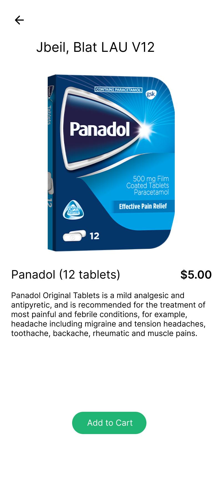
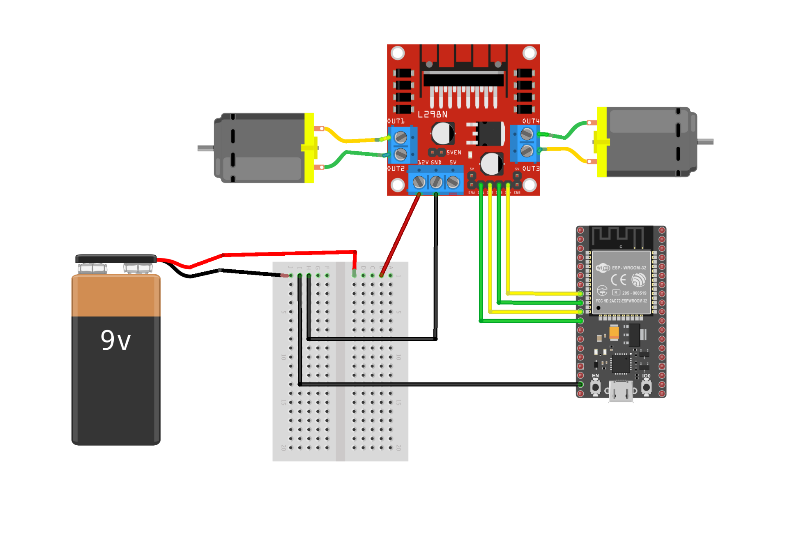

<br><br>

<!-- project philosophy -->


> A smart pharmaceutical vending machine that aims to address the unavailability of basic pharmaceuticals and ensure their accessibility in situations where pharmacies are closed or unavailable. By integrating microcontrollers, actuators, and advanced technologies, we automate the dispensing and payment processes to provide convenience and reliability.
>
> Our solution features an interactive robotic system and an AI-trained model for pattern recognition across various areas. Additionally, we offer a user-friendly interface that helps users locate nearby vending machines and enables real-time communication with the system. This approach streamlines access to essential pharmaceuticals and enhances the overall user experience.

### User Stories

#### Customer
- As a Customer, I want to locate nearby vending machines, so I can quickly access essential pharmaceuticals when pharmacies are closed.
- As a Customer, I want to browse available medicines and their details, so I can find and select the medication I need.
- As a Customer, I want the system to guide me to the machine and allow me to shop and dispense medicantions of my choice.

#### Admin 
- As an admin, I want to manage and monitor the stock levels in vending machines, so I can restock them promptly to avoid shortages.
- As an admin, I want to review and analyze sales data, so I can identify trends and improve vending machine performance.
- As an admin, I want the vending machine inventory to be updated in real time and reflected accurately to users, ensuring credibility and trust in the system.
<br><br>
<!-- Tech stack -->


> PharmaVend thrived using the below stacks

###  PharmaVend is -built using the following technologies:

- This project uses the [Flutter app development framework](https://flutter.dev/). Flutter is a cross-platform hybrid app development platform which allows us to use a single codebase for apps on mobile, desktop, and the web.
- For backend development, the app uses [Laravel](https://laravel.com/), a PHP-based framework known for its scalability and robust API handling capabilities.
- The user and admin panel websites are built using [React](https://react.dev/), a front-end library that delivers a dynamic and interactive interface.
- Both the Flutter application and the user admin panel employ [Redux](https://redux.js.org/) for state management. This predictable state container facilitates the handling of state across all user interfaces, enhancing manageability and cleanliness in dynamic and complex applications.

- The application enhances its functionality with several [Google APIs](https://console.cloud.google.com/apis/dashboard?inv=1&invt=AbnWKg), each serving a unique purpose:
  -  [Maps JavaScript API](https://developers.google.com/maps/documentation/javascript/overview): Provides interactive maps and location features on the application and admin panels.
  - [Geolocation API](https://developers.google.com/maps/documentation/geolocation/overview): Allows the app to retrieve the current location of the user by accepting an HTTPS request with the cell tower and WiFi access points that a mobile client can detect. 
  -  [Distance Matrix API](https://developers.google.com/maps/documentation/distance-matrix/overview).: Calculates travel distance and time for a matrix of origins and destinations, useful for managing delivery times and logistics.
  - [Directions API](https://developers.google.com/maps/documentation/directions/overview): Supplies route directions between multiple locations which are used to plot navigational routes on the map. 
  - [Reverse Geocoding API](https://developers.google.com/maps/documentation/geocoding/overview): Converts geographic coordinates into a human-readable address. 
- The project leverages [Firebase](https://console.firebase.google.com/), a comprehensive app development platform by Google, known for its wide array of tools and services:
  - [Google Sign in](https://firebase.google.com/docs/auth/android/google-signin): Integrated for secure and quick user authentication using Google accounts.
  - [Firebase Cloud Messaging](https://firebase.google.com/docs/cloud-messaging): Used for dispatching notifications to enhance user interaction and app communication.
- The IoT integration is powered by the [Arduino Platform](https://www.arduino.cc/), utilizing the [ESP32 microcontroller](https://www.espressif.com/en/products/socs/esp32) to control actuators for precise and reliable dispensing of products.


<br><br>
<!-- UI UX -->


> We designed PharmaVend using wireframes and mockups, iterating on the design until we reached the ideal layout for easy navigation and a seamless user experience.

- Project Figma design [figma](https://www.figma.com/design/7ouYeUwMOHD4Q3yAhSmUx7/Final-project?node-id=0-1&p=f&t=3UV9S1T6sdou9NPQ-0)

### Mockups

| Home Screen                | Map Screen               | Checkout Screen              |
|-------------------------------|--------------------------|--------------------------|
|  |  |  |
<!-- 
| Details Screen                | Cart Screen             | Checkout Screen           |
|-------------------------------|--------------------------|--------------------------|
|  |  |  |

| History Screen                | Dispense Screen          | Landing #2               |
|-------------------------------|--------------------------|--------------------------|
|  |  |  | -->

<br><br>

<!-- Database Design -->


> Below you can see PharmaVend's DB design:

###  Architecting Data Excellence: Innovative Database Design Strategies:


<p align="center">
  
</p>

<br><br>


<!-- Implementation -->


> Below you can see PharmaVend in action:


### User Screens (Mobile)
#### Visual Overview
| Login Screen                | Register Screen               | Landing Screen              |
|-------------------------------|--------------------------|--------------------------|
|  |  |  |

| Other Landing Screen                | Home Screen             | Map Screen           |
|-------------------------------|--------------------------|--------------------------|
|  |  |  |

| Product Detail Screen                | Cart Display Screen          | Checkout Screen               |
|-------------------------------|--------------------------|--------------------------|
|  |  |  |

| User History Screen                | Product Dispense Screen          | Notification Screen               |
|-------------------------------|--------------------------|--------------------------|
|  |  |  |

#### Interactive Walkthrough
| Sign Up Demo                | Google Signin Demo               | Find Closest Machine               | 
|-------------------------------|--------------------------|--------------------------|
|  |  |  | 

| Checkout Demo                | Search medicine Demo               | Notification Update               | 
|-------------------------------|--------------------------|--------------------------|
|  |  |  | 

| Map Navigation Demo                | 
|-------------------------------|
|  | 

### Admin Screens (Web)
#### Visual Overview
| Dashboard Screen #1  | Dashboard Screen #2 |
| ---| ---|
|  |  |

| Orders Screen #1  | Orders Screen #2 |
| ---| ---|
|  |  |

| Inventory Screen #1  | Inventory Screen #2 |
| ---| ---|
|  |  |

| Machines Screen  | Products Screen  |
| ---| ---|
|  |  |

| Customers Screen #1  | Customers Screen #2 |
| ---| ---|
|  |  |

#### Interactive Walkthrough

Machine Navigation 


Machine Deployment


### Customer Screen (Web)

<br><br>


<!-- Prompt Engineering


###  Mastering AI Interaction: Unveiling the Power of Prompt Engineering:

- This project uses advanced prompt engineering techniques to optimize the interaction with natural language processing models. By skillfully crafting input instructions, we tailor the behavior of the models to achieve precise and efficient language understanding and generation for various tasks and preferences.

<br><br> -->

<!-- AWS Deployment


###  Efficient AI Deployment: Unleashing the Potential with AWS Integration:

- This project leverages AWS deployment strategies to seamlessly integrate and deploy natural language processing models. With a focus on scalability, reliability, and performance, we ensure that AI applications powered by these models deliver robust and responsive solutions for diverse use cases.

<br><br> -->

<!-- Unit Testing


###  Precision in Development: Harnessing the Power of Unit Testing:

- This project employs rigorous unit testing methodologies to ensure the reliability and accuracy of code components. By systematically evaluating individual units of the software, we guarantee a robust foundation, identifying and addressing potential issues early in the development process.

<br><br> -->


> To build PharmaVend prototype, follow these steps:

### Electrical Components Connections
<!-- - To drive Stepper Motor with A4988 IC and Linear Motors with L298n IC on an esp, you need to follow these steps: -->
#### I. Stepper Motor with A4988 IC Conenction

- 1- Prerequesits
   - ESP32/8266 module
   - Stepper Motor (preferable Nema 17)
   - Stepper Motor Driver A4988 IC
   - Battery (9-12V)

- 2- Overview
   - **Stepper Motor phase output pin order**:
      The stepper motor in our application have a wiring of A+, A-, B+ and B- which power the phase in proper sequence.
   - **MSx pins on the A4988 driver IC**: 
      The driver IC contains three input pins. You can set the pins to control the micro-stepping resolution. 

     | MS1 | MS2 | MS3 | Microstep Resolution | Excitation Mode |
     |-----|-----|-----|----------------------|-----------------|
     | L   | L   | L   | Full Step            | 2 phase         <---**Method Utilizied**| 
     | H   | L   | L   | Half Step            | 1-2 phase       |
     | L   | H   | L   | Quarter Step         | W1-2 phase      |
     | H   | H   | L   | Eight Step           | 2W1-2 phase     |
     | H   | H   | H   | Sixteenth Step       | 4W1-2 phase     |

- 3- Connections
   | A4988 Connections   | ESP32 Pins | Stepper Motor Connections |
   |---------------------|------------|--------------------------|
   | DIR                 | GPIO 15    |                          |
   | STEP                | GPIO 2     |                          |
   | ENABLE              | GPIO 13    |                          |
   | VCC                 | 3.3V/5V    |                          |
   | GND                 | GND        | GND                      |
   | Motor Output A+     |            | Coil 1+                  |
   | Motor Output A-     |            | Coil 1-                  |
   | Motor Output B+     |            | Coil 2+                  |
   | Motor Output B-     |            | Coil 2-                  |


#### II. Linear DC Motors with L298n Driver

- 1- Prerequesits
   - ESP32/8266 module
   - 2x Linear DC Motors
   - Motor Driver L298n Driver
   - Battery (9-12V)

- 2- Overview
   - **DC Motor Configurations**: 
      If you want to build a robot car using 2 DC motors, these should be rotating in specific directions to make the robot go left, right, forward, or backward.

   | DIRECTION | INPUT 1 | INPUT 2 | INPUT 3 | INPUT 4 |
   |-----------|---------|---------|---------|---------|
   | Forward   | 0       | 1       | 0       | 1       |
   | Backward  | 1       | 0       | 1       | 0       |
   | Right     | 0       | 1       | 0       | 0       |
   | Left      | 0       | 0       | 1       | 0       |
   | Stop      | 0       | 0       | 0       | 0       |

- 3- Connections
   | Description         | ESP32 Pin | L298N Connection | Note                  |
   |---------------------|-----------|------------------|-----------------------|
   | Motor 1 Extend      | GPIO 26   | Input 1          | Motor 1 direction     |
   | Motor 1 Retract     | GPIO 27   | Input 2          | Motor 1 direction     |
   | Motor 1 Enable      | GPIO 13   | Enable 1         | Enable Motor 1        |
   | Motor 2 Forward     | GPIO 33   | Input 3          | Motor 2 direction     |
   | Motor 2 Backward    | GPIO 32   | Input 4          | Motor 2 direction     |
   | Motor 2 Enable      | EN        | Enable 2         | Enable Motor 2        |
   | Power Supply (VCC)  |           | VCC              | 9V DC Battery |
   | Ground (GND)        |           | GND              | Common ground connection |



#### III. Combined Connection of the whole robotic system


### Mechanical Engineering Design
- The design was initially modeled using SOLIDWORKS, a mechanical engineering design software. This process facilitated the transition from digital design and modeling of the system to manufacturing and assembling the actual components.

Visual Overview of the system


Interactive Walkthrough of the system


### Real Time Demo

<!-- How to run -->


> To set up PharmaVend locally, follow these steps:

### Prerequisites

This is an example of how to list things you need to use the software and how to install them.

* npm
  ```sh
  npm install npm@latest -g
  ```
- Flutter SDK
- Composer (for PHP dependencies)
- Arduino IDE
- ESP32/8266 module
- Google Cloud Platform (GCP) project with the following enabled:
   - Maps JavaScript
   - Geolocation
   - Distance Matrix
   - Directions
   - Reverse Geocoding
- Firebase CLI
### Installation

#### Cloning the Repository

1. Run the following command to clone the repository and all its submodules

   ```sh
   git clone --recurse-submodules [github](https://github.com/jeanpierrenashef/PharmaVend.git)
   ```

#### Server Configuration (Laravel)

1. Navigate to PharmaVend-server directory

   ```sh
   cd PharmaVend-server
   ```

2. Install composer packages
   ```sh
   composer install
   ```
3. Run the following command and fill the necessary values in the created .env file
   ```sh
   cp .env.example .env
   ```
4. Run the following command to populate the database
   ```sh
   php artisan migrate
   ```
5. Start the Laravel development server
   ```sh
   php artisan serve
   ```
#### Application Configuration (Flutter)

1. Install Flutter SDK

2. Navigate to PharmaVend-app directory

   ```sh
   cd PharmaVend-app
   ```

3. Install the required packages as defined in the pubspec.yaml file

   ```sh
   flutter pub get
   ```

4. Run the following command and fill the necessary values in the created .env file

   ```sh
   cp .env.example .env
   ```

5. Make sure Firebase CLI is installed on your machine. If not, install it using the following commands. This CLI tool helps connect your Flutter project with your Firebase project.
   ```sh
   dart pub global activate flutterfire_cli
   flutterfire configure
   ```
6. Run the Flutter application
   ```sh
   flutter run
   ```

#### Admin Panel Configuration (ReactJS)

1. Navigate to PharmaVend-adminPanel directory

   ```sh
   cd PharmaVend-adminPanel
   ```

2. Install NPM packages
   ```sh
   npm install
   ```
3. Run the following command and fill the necessary values in the created .env file
   ```sh
   cp .env.example .env
   ```
4. Run the React project
   ```sh
   npm run start
   ```

#### Arduino Configuration

1. Navigate to PharmaVend-IoT directory

   ```sh
   cd PharmaVend-IoT
   ```

2. Set the variables in wifi.cpp file according to your network and sever

   ```cpp
   const char* ssid = "<Network-ssid>";
   const char* password = "<Network-password>";
   ```

3. Follow the steps mentioned above in the IoT System section for connections

Now, you should be able to run PharmaVend locally and explore its features.